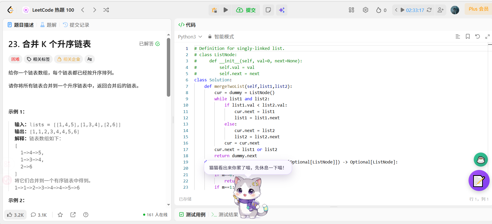
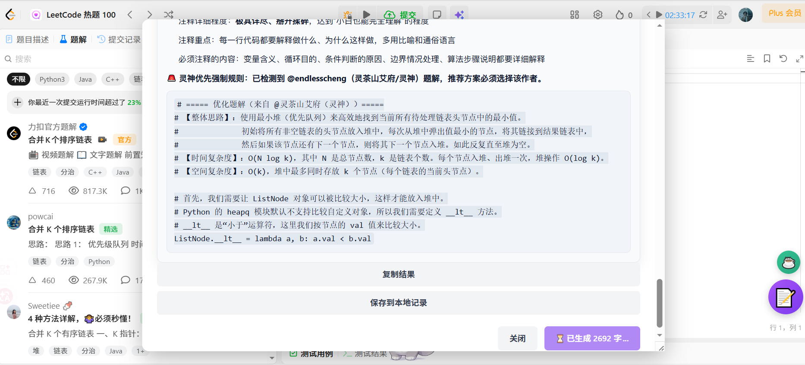
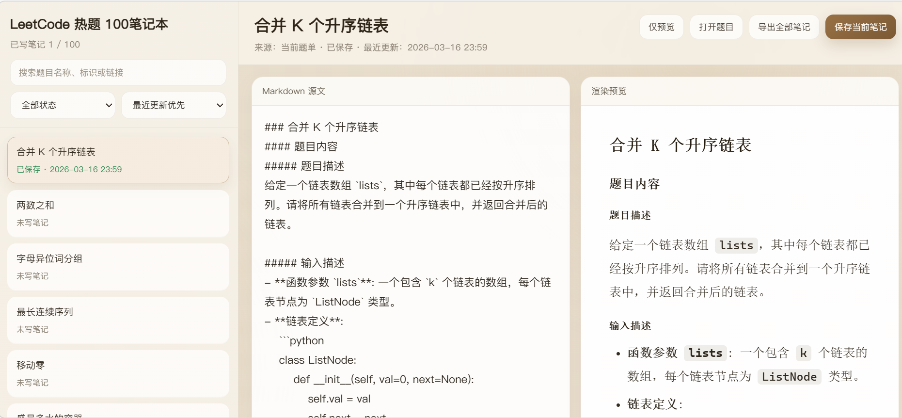
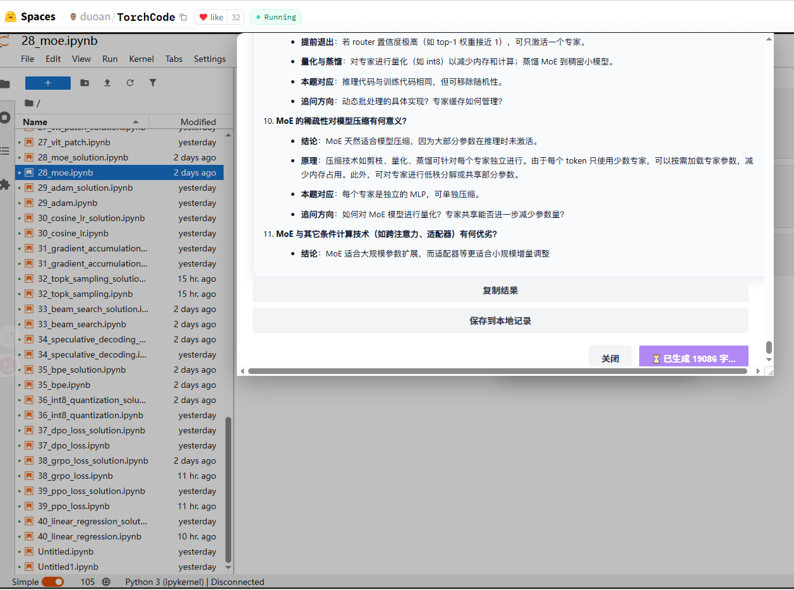
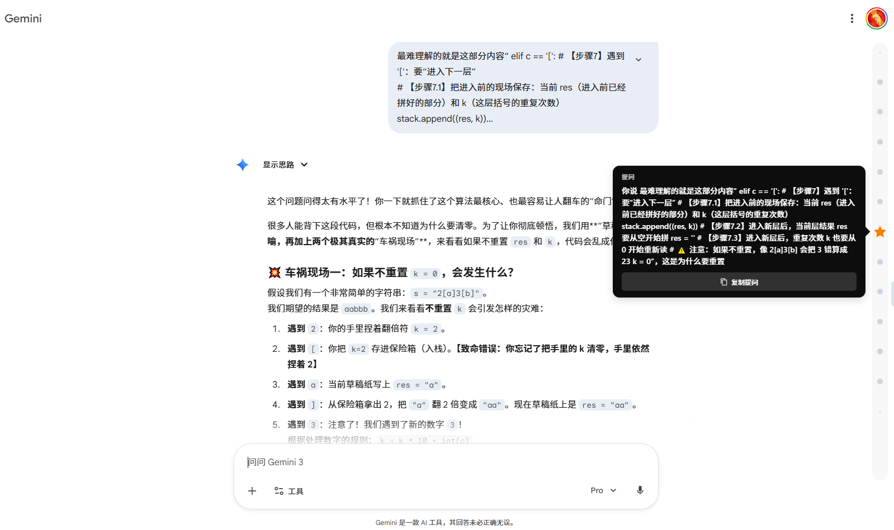



# CodeNote Helper

**算法刷题笔记 · 深度学习复盘 · AI 对话时间轴**

一个专为算法刷题、深度学习 和 AI 学习场景打造的浏览器扩展 自动生成高质量复盘笔记，轻松驾驭超长对话 让刷过的每一道题都沉淀为技术资产

  

[功能亮点](#features) · [快速开始](#quick-start) · [使用指南](#guide) · [权限说明](#permissions) · [同步与备份说明](#sync-backup) · [API 配置](#api-config) · [English](#english)

---

## 📖 使用指南

### 💡 这些场景你一定经历过

**刷力扣的时候：**
- 做完一道题想让 AI 帮忙讲讲思路，却要先复制题目，再复制代码，最后还要把参考题解也贴过去，来回折腾好几分钟才能开始提问。
- 看完题解后虽然能懂代码逻辑，但依然不明白为什么要这样想，关键的突破口到底在哪里。
- 提交代码后想知道自己的做法是否最优，AI 却只会给出思路不错这种毫无营养的场面话。
- 辛辛苦苦刷了两百多道题，过了一个月回头看却发现忘得一干二净，因为根本没有沉淀下可以用来复习的笔记。

**准备深度学习手撕代码的时候：**
- Attention、BatchNorm、CrossEntropy…… 考前每个都手撕了一遍，考完却又全忘了，下次复习依然要从零开始。
- 在 TorchCode 或 Deep-ML 上练完一道题，想用 AI 帮忙做个复盘笔记，又得重复那套枯燥的复制粘贴流程。

**和 AI 长时间对话的时候：**
- 一个题单三十多道题都在同一个对话里问，想找之前某道题的回答只能不停地滚轮翻页。
- 想要回顾之前的关键回答？滚动到手酸也不一定找得到。

**CodeNote Helper 就是为了终结这些低效与内耗而生 ✨  无论是算法刷题、深度学习实战，还是与 AI 的超长对话，它都能为你自动打通上下文: 
一键生成结构化笔记、智能深挖代码考点，并构建清晰的对话时间轴导航。 把脏活累活交给插件，把时间留给真正的思考！**

---

## ✨ 功能亮点

### 📝 算法刷题笔记助手
> 在 LeetCode / CodeFun2000 题目页面自动启用

- **一键生成结构化笔记**：自动抓取题目描述、你写的代码、参考题解，交给 AI 生成包含思路分析、逐行代码讲解、复杂度分析的完整 Markdown 笔记。
- **真正有用的代码评价**：不再是敷衍的夸奖，而是针对你的代码实现逐段分析优缺点，给出具体的评分和改进方向。
- **高质量题解优先推荐**：自动识别灵茶山艾府等大佬的题解并置顶作为推荐方案，帮你直接学习最优解法。
- **三种灵活的使用方式**：复制 Prompt 粘贴到任意 AI 对话、直连 API 在页面内直接生成、或一键跳转到 ChatGPT / Claude / Gemini / DeepSeek。
- **大语言模型 API 流式输出**：配置好 API 后，可在题目页面内直接生成笔记，支持实时流式响应，**所见即所得**。
- **题单进度追踪**：支持导入 Hot100、面试经典 150、灵神题单，**自动追踪做题状态**，全部完成时还有庆祝动画 🎉。
- **独立笔记本**：内置双栏 Markdown 编辑器，支持实时预览、公式渲染与一键导出，**所有笔记集中管理**。
- **灵活易用**：esc关闭笔记生成页面，拖动笔记生成页面边缘调整页面大小，拖动笔记以及咖啡按钮调整位置

### 🧠 深度学习笔记助手
> 在 Deep-ML / TorchCode 页面自动启用

- **面向 Notebook 的复盘笔记**：自动读取当前题目、你的实现代码和内置参考实现，**生成结构化的深度学习笔记**。
- **题型智能分流**：自动识别 Attention、Normalization、Training Loop 等题型，生成对应的**面试深挖考点**。
- **无缝兼容**：完美支持 `deep-ml.com` 题目页和 TorchCode Hugging Face Space 工作区，数据与算法笔记统一管理。

### ⏱️ AI 对话时间轴
> 在 ChatGPT / Gemini / Claude 页面自动启用

- **可视化时间轴**：在对话页面右侧生成时间轴导航条，整段对话的结构一目了然。
- **点击跳转**：点击任意节点直接滚动到对应的消息位置，告别无尽翻页。
- **星标收藏**：长按节点标记为 ⭐️，把重要的回答钉在时间轴上，随时回看。
- **悬停预览**：鼠标悬停即可预览消息内容，无需跳转就能快速确认。

---

## 🚀 快速开始

### 方式一：应用商店一键安装（推荐）

直接访问 Chrome 应用商店安装（**Edge 浏览器同样可以直接使用此链接安装**）：
👉 **[点击前往 Chrome Web Store 下载安装](https://chromewebstore.google.com/detail/codenote-helper/kimmpnikdpgdecieafahiekobhcmckoa)**

### 方式二：离线安装（开发者模式）

如果你无法访问应用商店，可以通过 GitHub Releases 下载离线包：

1. 访问本项目的 **[Releases 页面](https://github.com/Philip-Cao-9527/code-note-helper/releases)**，下载最新版本的 `.zip` 压缩包并解压到一个固定的文件夹中。
2. 打开浏览器的扩展管理页面：
   - Chrome: 地址栏输入 `chrome://extensions/`
   - Edge: 地址栏输入 `edge://extensions/`
3. 打开页面右上角的**开发者模式**开关。
4. 点击**加载已解压的扩展程序**，选择你刚刚解压的文件夹。
5. **开始使用 🎉** —— 工具栏会出现扩展图标，打开任意 LeetCode 题目页面即可看到右下角的 📝 按钮。

---

## 🛡️ 权限说明（为什么需要这些权限？）

在安装插件时，浏览器可能会提示你需要授予以下权限:
* **读取和更改您在一些网站的数据**
* **修改您复制和粘贴的数据**

这属于浏览器扩展的正常权限提示，不代表本扩展会在所有网站上读取你的数据。

### 关于“继续操作有风险，请三思”提示（增强型安全浏览）

如果你开启了 Chrome 的**增强型安全浏览（Enhanced protection）**，安装扩展时可能会先出现一层额外风险提示，例如“增强型安全浏览功能不信任此扩展程序”。  
这层提示来自浏览器的增强保护机制，不是本扩展额外申请了新权限。通常会先看到该提示，再进入常规的“添加扩展程序/权限确认”弹窗。  
对新上架或信任积累时间较短的开发者，这类提示更常见，并不等同于扩展本身存在恶意行为。

### 这些权限分别是做什么的？

#### 1. 读取和更改您在一些网站的数据

这是因为扩展需要在受支持的网站里注入功能界面，并读取当前页面里与你主动使用功能相关的内容，例如：

* LeetCode / CodeFun2000 的题目描述、代码区域、题解区域
* Deep-ML / TorchCode 的题目与代码内容
* ChatGPT / Gemini / Claude 的对话消息，用于生成时间轴导航
* 坚果云 WebDAV 地址，用于你主动触发的备份与恢复

这些权限只用于扩展的核心功能，不会用于无关站点。

#### 2. 修改您复制和粘贴的数据

这是因为扩展支持：

* 一键复制 Prompt
* 一键复制生成结果
* 便捷复制笔记内容

也就是说，只有在你点击复制相关功能时，扩展才会写入剪贴板。

### 扩展当前会在哪些站点启用功能？

* LeetCode 中国站 / 国际站
* CodeFun2000
* Deep-ML
* TorchCode
* ChatGPT
* Gemini
* Claude
* 你自己配置的 API 地址
* 你自己填写的坚果云 WebDAV 地址

如果你不打开这些站点，相关功能也不会生效。

---

## 🌐 支持站点

| 站点 | 功能 |
|---|---|
| [LeetCode 中国站](https://leetcode.cn/) | 算法刷题笔记 |
| [LeetCode 国际站](https://leetcode.com/) | 算法刷题笔记 |
| [CodeFun2000](https://codefun2000.com/) | 算法刷题笔记 |
| [Deep-ML](https://www.deep-ml.com/) | 深度学习笔记 |
| [TorchCode Hugging Face Space](https://huggingface.co/spaces/duoan/TorchCode) | 深度学习笔记（[GitHub 仓库](https://github.com/duoan/TorchCode)） |
| [ChatGPT](https://chatgpt.com/) | AI 对话时间轴 |
| [Gemini](https://gemini.google.com/) | AI 对话时间轴 |
| [Claude](https://www.anthropic.com/claude) | AI 对话时间轴 |

## ☁️ 同步与备份说明

所有数据默认保存在浏览器本地，不联网也能正常使用。如果需要在多设备间同步，我们在**扩展设置页**（点击插件图标打开 Popup → 设置与同步）提供了以下选项：

### 🥇 推荐方案：坚果云 WebDAV (完整备份)
这是最稳定、安全的完整备份方案，会将所有数据（记录、题单、笔记）打包上传到你的坚果云空间，没有容量限制。

⚠️ **【非常重要】坚果云防覆盖指南：**
如果你之前已经使用坚果云备份过数据，在新设备重新安装插件并登录坚果云后，**请务必点击「从云端恢复」**！
千万不要直接点击「立即备份」，否则本地的空状态会直接覆盖掉云端的历史数据。（注：点击「测试备份」检查连通性是安全的，不会造成覆盖）。

### 🥈 备选方案：本地 JSON 导出
最简单的物理备份方式。手动导出一份 JSON 文件保存到本地，随时可以导入恢复。适合不想折腾云服务、偶尔手动备份的用户。

### 🚫 关于 Cloud Sync 的说明
**支持轻量备份，容量大概在150题左右，现阶段该功能存在bug**，强烈建议优先使用坚果云进行备份。

---

## ⚙️ API 配置

如果你想在页面内直接生成笔记（直连 API 模式），需要在设置页填写 API 信息。扩展支持所有兼容 OpenAI 接口格式的 API（如 DeepSeek、Moonshot、各类中转站等）。

### 参考配置（以ChatAnyWhere 中转站为例）

- ChatAnyWhere 开源仓库：https://github.com/chatanywhere/GPT_API_free

| 配置项 | 值 |
|--------|-----|
| Base URL | `https://api.chatanywhere.tech/v1` |
| Model | `deepseek-v3.2` 或其他支持的模型 |
| API Key | 你的专属 Key（`sk-...`） |

> **常见防坑指南**：
> - **API 返回 404 / Invalid URL**：请确保 Base URL 以 `/v1` 结尾。
>   - ✅ 正确：`https://api.openai.com/v1`。
>   - ❌ 错误：`https://api.openai.com/v1/chat/completions`（插件会自动拼接后缀，请勿手动写全）。

---

## 🔒 隐私声明

- 默认情况下，所有数据保存在浏览器本地，**不会发送到任何开发者的服务器**。
- 如果你开启了坚果云备份，数据只会同步到**你自己的** WebDAV 空间。
- 如果你使用直连 API，数据仅会发送到**你自己配置的**模型接口。

详见 [PRIVACY POLICY.md](./PRIVACY%20POLICY.md)。

---

## 🤝 贡献与反馈

开源不易，如果这个插件帮助到了你，欢迎给个 ⭐ Star！
也欢迎提交 Issue 和 Pull Request：

- 🐛 [报告 Bug 或功能建议](https://github.com/Philip-Cao-9527/code-note-helper/issues)

---
## 🙏致谢
- [Leetcode-Mastery-Scheduler](https://github.com/xiaohajiayou/Leetcode-Mastery-Scheduler) - 参考了该项目的部分数据同步设计，也可以搭配该项目使用，同步复习力扣
---

## ⭐ Star History

---

## 📜 License

[MIT License](./LICENSE) © 2026 cao

---

## 🇬🇧 English

**CodeNote Helper** is a Chrome/Edge extension that takes the repetitive busywork out of studying algorithms and deep learning. No more copy-pasting problems, code, and solutions back and forth just to ask AI a question.

### Quick Start

👉 **[Install from Chrome Web Store](https://chromewebstore.google.com/detail/codenote-helper/kimmpnikdpgdecieafahiekobhcmckoa)** (Compatible with Microsoft Edge)

**Manual Installation:**
1. Download the latest `.zip` release from the [Releases page](https://github.com/Philip-Cao-9527/code-note-helper/releases).
2. Unzip the file.
3. Open `chrome://extensions/` (or `edge://extensions/`), enable **Developer Mode**.
4. Click **Load unpacked** and select the unzipped folder.

### Privacy & Data
All your notes and progress stay in your local browser by default. Optional features like Nutstore WebDAV backup and API generation only connect to your personal cloud storage or the AI models you configure. No data is ever collected by the developer.

### 🙏Acknowledgments
- [Leetcode-Mastery-Scheduler](https://github.com/xiaohajiayou/Leetcode-Mastery-Scheduler) — inspiration for the data sync design and a great companion project for LeetCode review workflows.

### License
[MIT](./LICENSE) © 2026 cao

